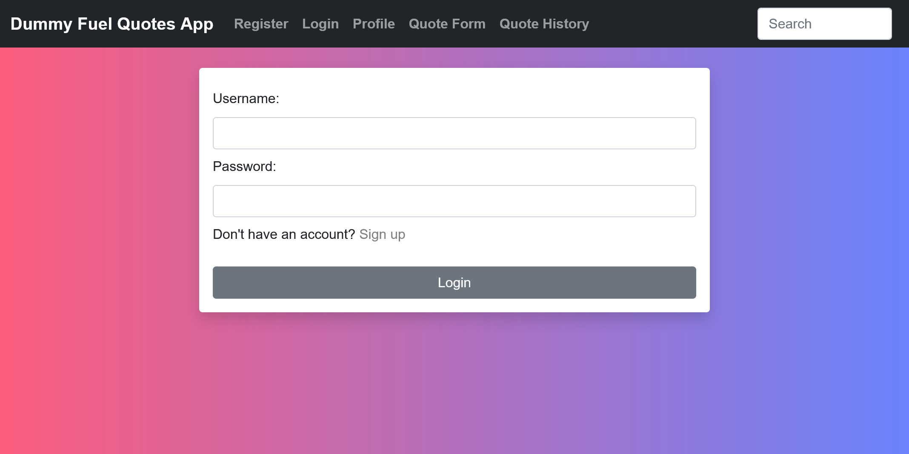

# Fuel App

## Group 47

### Contributors:

1. Nimet Ozkan

2. Joshua Garcia

3. John Nguyen

4. Ming-Kai Chen


## Instructions
Before running the script, run this in the terminal:
```
pip install -r requirements.txt
```

To run the website, run:
```
python main.py
```

## Frontend
* Home Page



* Registration Page


* Login Page


* Profile Page


* Quote Form


* Quote History

